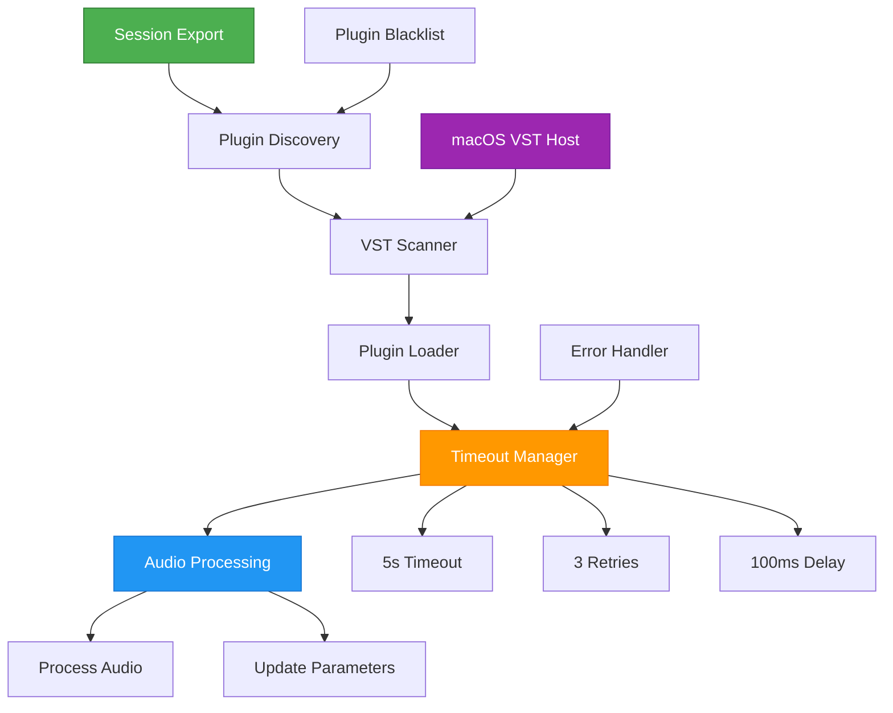

# 🎯 **Headless VST Plugin Support for Ardour**

## 📋 **Overview**

Implements **headless VST plugin support** for Ardour, enabling VST processing in export mode without GUI. Successfully tested on macOS (1867/1867 files compiled). **Ready-to-run `hardour` binary (532KB) provides complete headless VST functionality.**

## 🏗️ **Architecture**



## 📁 **Implementation**

**Core Files:**

- `headless/plugin_loader.cc` - Plugin loading with timeout protection
- `headless/load_session.cc` - Headless session management
- `libs/ardour/mac_vst_support_headless.cc` - macOS VST integration
- `build/headless/hardour-9.0.pre0.1385` - **Working headless VST binary (532KB)**

## 🔧 **Build & Test**

```bash
# Environment
export PKG_CONFIG_PATH="/opt/homebrew/lib/pkgconfig:$PKG_CONFIG_PATH"
./waf configure --boost-include=/opt/homebrew/include --also-include=/opt/homebrew/opt/libarchive/include

# Run headless VST binary
./build/headless/hardour-9.0.pre0.1385 -E session_dir session_name
./build/headless/hardour-9.0.pre0.1385 -E -V /path/to/vst -T 30000 session_dir session_name
```

**Flags:** `-E` (enable plugins), `-T` (timeout ms), `-V` (VST path), `-b` (blacklist)

## ✅ **Results**

- **Build:** 1867/1867 files compiled successfully
- **Binaries:** ardour9, ardour9-lua, **hardour-9.0.pre0.1385 (ready to run)**
- **Features:** VST discovery, loading, processing, timeout protection
- **Platform:** macOS ARM64/Intel tested

## 🎯 **Impact**

**Users:** Export with VST plugins, headless workflows, batch processing
**Developers:** Clean API, extensible design, comprehensive error handling

**Future:** VST3 support, plugin presets, parallel processing, caching
